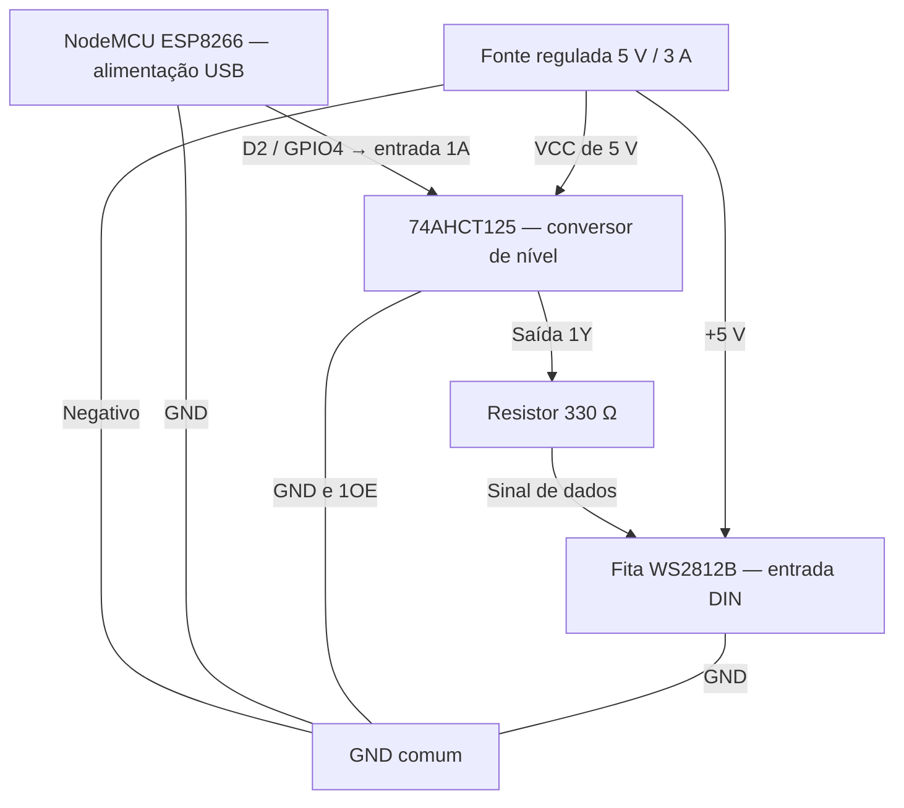

# controle-led-enderecavel
Aplicativo Flutter e firmware ESP8266 para controlar fita LED endereçável pela rede Wi-Fi

## Guia visual de montagem — protótipo

Base: NodeMCU ESP8266 e fita WS2812B 5 V, inicialmente com até 30 LEDs.
Este é o esquema proposto de montagem; ainda não foi validado em hardware.

### Componentes

- NodeMCU ESP8266, alimentado por USB.
- Fita WS2812B 5 V (IP30), de 10 a 30 LEDs.
- Fonte regulada 5 V / 3 A para a fita.
- Conversor de nível 74AHCT125 (não substituir por 74HC125).
- Resistor de 330 Ω, junto à entrada DIN da fita.
- Capacitor eletrolítico de 1000 µF / 10 V junto à alimentação da fita.
- Capacitor cerâmico de 100 nF junto à alimentação do 74AHCT125.
- Fios e conectores.

### Esquema básico

O capacitor de 1000 µF fica em paralelo entre +5 V e GND da fita: terminal positivo em +5 V e terminal negativo em GND. O capacitor de 100 nF fica entre VCC e GND do conversor.

### Ligações ponto a ponto

Pinagem abaixo para o CI 74AHCT125 de 14 pinos. Se usar um módulo, confira a pinagem do fabricante.

| Origem | Destino |
| --- | --- |
| NodeMCU D2 / GPIO4 | 74AHCT125 pino 2 (1A) |
| 74AHCT125 pino 3 (1Y) | Resistor de 330 Ω |
| Outra ponta do resistor | DIN da fita |
| Fonte +5 V | +5 V da fita e pino 14 (VCC) do conversor |
| Fonte negativo | GND da fita, GND do NodeMCU e pino 7 do conversor |
| 74AHCT125 pino 1 (1OE) | GND — habilita a saída |
| Capacitor eletrolítico positivo | +5 V da fita |
| Capacitor eletrolítico negativo | GND da fita |
| Capacitor cerâmico de 100 nF | Entre pinos 14 e 7 do conversor |

Nos canais não utilizados do 74AHCT125, ligue os pinos de habilitação 4, 10 e 13 em +5 V e as entradas 5, 9 e 12 em GND. Deixe as saídas 6, 8 e 11 desconectadas.

### Montagem e primeiro teste

1. Monte com todas as fontes desligadas.
2. Confira +5 V, GND e DIN pela inscrição da fita, sem depender apenas da cor dos fios.
3. Conecte o sinal no lado DIN; a seta da fita aponta do primeiro LED para os seguintes.
4. Alimente a fita diretamente pela fonte externa. Não passe a corrente da fita pelo NodeMCU e não conecte 5 V ao pino 3V3.
5. Ligue primeiro a fonte da fita e depois o USB do NodeMCU. Para desligar, desligue primeiro o NodeMCU.
6. No firmware, use GPIO4, a quantidade real de LEDs e brilho baixo para o primeiro teste.

A fonte de 5 V / 3 A é uma escolha conservadora para até 30 LEDs; recalcular a alimentação se ampliar a fita.

Referência: [Adafruit — boas práticas para NeoPixels](https://learn.adafruit.com/adafruit-neopixel-uberguide/best-practices).

